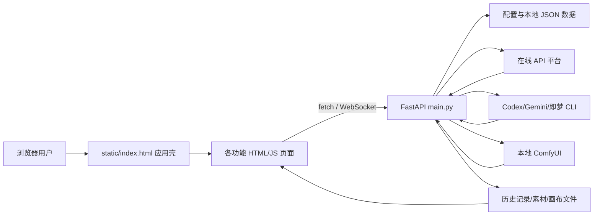

# 小美画布项目总览

## 1. 项目用途

小美画布是面向电商视觉生产的本地 Web 工作台，目标是把素材、提示词策划、在线图像模型、批量任务、无限画布和历史资产放进一个统一界面。项目本身不内置大模型权重；AI 能力来自用户配置的在线 API、CLI 或本地 ComfyUI。RunningHub 只保留推荐 API 区的快捷配置卡片和后端兼容能力，不作为左侧平台或画布来源入口。

## 2. 当前主要入口

| 入口 | 页面 | 主要用途 |
|---|---|---|
| ComfyUI | `/static/comfyui.html`（文件位于 `ComfyUI/web/comfyui.html`） | 本地 AI 应用库、工作流导入与准备、结果下载；高级编辑保留节点界面 |
| GPT 对话 | `static/gpt-chat.html` | 对话、附件、可选模型、Agent 图片生成/编辑 |
| 小美画布 | `static/smart-canvas.html` | 节点画布、连线、批量参考图、生成结果、历史/素材/工作流 |
| 电商工作台 | `static/commerce.html` | 一键主图、一键详情页、智能分析、分段提示词确认、批量生图 |
| 任务管理 | 商品分析台内的任务管理 | 定时任务、商品采集任务、计划筛选、启停、立即运行和删除 |
| 素材库 | `static/asset-manager.html` | 素材上传、目录、搜索、分类、提示词与工作流资产 |
| 历史记录 | `static/history.html` | 历史图片/视频筛选、预览、上一张/下一张、下载、删除；“管理历史”面板支持分组筛选与批量移除 |
| API 设置 | `static/api-settings.html` | 在线 API 平台、协议、Key、模型实时拉取和 CLI 设置 |

`static/index.html` 是应用壳。它加载侧栏和多个 iframe，并负责主题、语言、UI 缩放、页面切换以及历史大图预览。

## 3. 技术架构

### 前端

- 原生 HTML、CSS、JavaScript，无 React/Vue、无 npm 构建步骤。
- 主应用使用 iframe 分隔不同功能模块。
- 公共主题在 `static/css/theme.css` 与 `static/js/theme.js`。
- 图标和浏览器端第三方库放在 `static/vendor/`，部署时必须一并保留。

### 后端

- `main.py`：FastAPI 单体服务，包含路由、供应商协议适配、任务轮询、文件上传、本地持久化和静态目录挂载。
- 默认监听 `0.0.0.0:3000`。
- 静态挂载：`/static`、`/assets`、`/output`。
- WebSocket：`/ws/stats`，用于状态/资源信息。

### 数据

- JSON 文件持久化，当前没有数据库。
- 关键目录：`data/`、`assets/`、`output/`、`history.json`、`API/.env`。
- 发布包提供干净数据目录；运行后自动产生用户数据。

## 4. 不包含的能力

- 不包含本地模型权重。
- 不保证任何第三方 API 永久可用；模型名和协议由平台变化决定。
- 不包含用户真实 API Key、历史生成图片、个人素材和画布数据。

## 5. 代码规模与维护特点

- `main.py` 较大，是所有后端能力的集中入口。
- `smart-canvas.js`、`canvas.js`、`commerce.js` 和 `api-settings.js` 是前端重点大文件。
- 维护时优先做小范围、可验证的改动；API 字段变化必须同时核对多个页面调用方。
