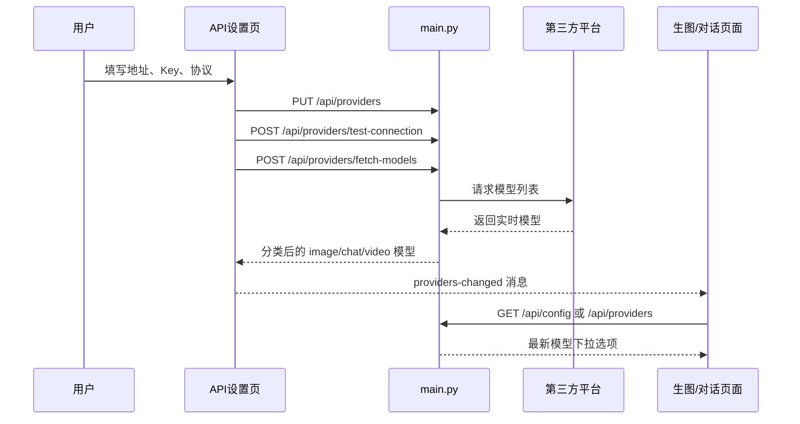

# 功能链路

## 1. 应用启动链路

1. `run.bat` 启动 Electron 桌面端，不打开系统浏览器。
2. Electron 复用或启动本地 FastAPI；`main.py` 加载 `API/.env`、供应商配置、本地目录和默认数据。
3. FastAPI 挂载 `static/`、`assets/`、`output/`，桌面端通过本地地址加载应用壳。
4. Electron 窗口加载 `static/index.html`，并把商品页显示在桌面端内部的 `WebContentsView` 中。
5. `index.html` 根据上次保存的页面、主题、皮肤、字体和 UI 缩放加载对应 iframe。

### 本地 ComfyUI 入口

左侧 ComfyUI 入口加载 `/static/comfyui.html`（文件位于 `ComfyUI/web/comfyui.html`），默认进入本地 AI 应用库。“高级编辑”保留本机原生节点界面，“画布参数配置”复用原有设置页。应用运行复用 `generate` 和画布持久化任务，结果写入现有生成存储和历史；直接在高级编辑器运行的任务仍由 ComfyUI 管理。导入、环境准备、SeeThrough 和故障处理见 [本地 AI 应用库](ComfyUI-AI应用库.md)。

## 2. API 平台与动态模型链路

小美画布打开项目时先读取并显示画布，API 配置、ComfyUI 工作流与应用目录随后在后台加载。模型列表返回前保留已保存的模型参数；配置加载结束后恢复未完成任务的轮询。

模型选择必须以平台拉取结果为准。图片模型按 Google/Gemini、GPT/OpenAI 等系列展示，但实际模型 ID 原样提交给平台。

### GPT 对话与 Skill 链路

- GPT 对话的图片模式和 Agent 自动生图/改图会先保存到“生成素材”目录，再写入 `history.json`；历史记录页显示为“GPT 对话生图”，并保留模型、尺寸、参考图和生成动作。
- GPT Agent 把“分析图片、想做主图/直通车图、给文案/提示词/思路”等请求固定视为文字任务；图片名词、上传附件或 Skill 指令不能单独触发生图。用户明确要求生成或改图时，系统先返回可编辑文案卡，只有点击“确认生图”后才调用图片模型；草稿阶段不产生生图请求。
- `static/gpt-chat.html` 顶部的“Skill”入口读取 `/api/agent-skills`。包式 Skill 安装在 `data/agent_skills/packages/<slug>/`，旧版 `data/agent_skills/*.md` 继续兼容；技能库支持搜索、分类/状态筛选和详情管理，分类管理入口可新建、重命名或删除自定义分类，删除分类时其中的 Skill 会回收到“自定义”；导入入口只保留“选择文件夹 → 自动检查 → 导入”三步。
- 包导入前通过 `POST /api/agent-skills/inspect-package` 校验包内容，再通过 `POST /api/agent-skills/import-package` 复制到应用数据目录；同时兼容普通单 Skill 目录（包含 `SKILL.md`，下载外层目录也可直接扫描），不要求用户准备 `manifest.json`、`_meta.json`、ZIP、教程或示例。浏览器“选择文件夹”走 `POST /api/agent-skills/inspect-upload`，上传内容只写入临时目录。导入完成后前端强制以 `no-store` 重新读取列表，成功只加入列表并定位到详情，不自动切换当前对话；当前仍使用通用助手时会明确提示。相同内容重复导入会提示“已存在，未重复导入”，内容变化或同名冲突需用户确认覆盖；桌面源目录不被修改。
- 选择 Skill 后，GPT 对话请求携带 `skill_id`；后端读取 `SKILL.md`，并仅加载正文中明确引用的文本 `references`，注入普通聊天、流式聊天和 Agent 路由/回复上下文。未选择或 Skill 不存在时保持通用助手行为；脚本、CLI、依赖安装和授权不会自动执行。
- `PATCH /api/agent-skills/{skill_id}` 控制包式 Skill 启用/停用，也可更新包式 Skill 的分类；分类定义由 `GET/POST/PATCH/DELETE /api/agent-skills/categories`（详情路径带 `{category_id}`）维护。`GET /api/agent-skills/{skill_id}/resource` 读取已登记资源，详情接口为 `GET /api/agent-skills/{skill_id}`。`POST /api/agent-skills/create` 仍创建不覆盖旧文件的单文件 Skill。
- 小美画布底部“偏好”里的 Skill 按钮打开紧凑的搜索选择器，适合按名称或说明快速切换；右上角积木按钮仍进入完整的 Skill 管理/安装面板。`browser-agent`（网页操作助手）作为显式可选 Skill 提供网页入口。
- 选择 `browser-agent` 后，画布 Agent 可通过 `/api/browser-agent/action` 打开可见网页、读取摘要/选择器文本、截图、列出媒体、下载媒体或点击精确可见目标；浏览器使用 `tools/commerce-analysis/browser-session.mjs` 和独立的 `data/browser_agent_profile/`。页面登录、验证码和外部提交仍由用户在可见浏览器中完成，未选择该 Skill 时不会自动打开网页。
- 商品分析台的“AI 助手”入口会跳转到 GPT 对话；两处使用同一浏览器用户标识和 `/api/conversations` 会话记录。商品分析台右侧的对话记录、新建、打开 GPT 和 GPT 历史列表会同步当前会话，聊天消息仍按用户目录持久化到 `data/conversations/`。

## 商品分析台链路

1. 用户可先点击 `static/commerce-analysis.html` 的“登录淘宝”。服务端通过 `POST /api/commerce-analysis/browser/login` 打开项目专用、可见的 Edge 到淘宝官方登录页；账号、密码、验证码均只在官方页面中由用户自行完成，浏览器会话保存在本地运行数据 `data/commerce_analysis_browser_profile/`。
2. 登录窗口状态通过 `GET /api/commerce-analysis/browser/session` 查询，仅返回本机 Edge 是否已连接、是否仍停在登录页等状态，不返回 Cookie、账号或页面内容。
3. 淘宝搜索结果页走轻量路径：Electron 通过 `commerce:capture-page-context` 只读取当前可见 DOM 中的关键词、页码、商品卡、价格、销量信号、发货地和主图，不滚动、不点击、不创建详情页任务；普通浏览器使用 `POST /api/commerce-analysis/page-context` 读取受限公开 HTML，且不再加载任何淘系备用 iframe。快照通过 `page_context` 一次性注入 `/api/chat`、`/api/chat/agent` 和 `/api/chat/stream`，右侧直接显示商品数量并提供“寻找市场机会”“分析价格带和销量分布”“总结标题高频词”“找出高销量低价竞品”四个入口。搜索词、页码或有效筛选参数变化会刷新快照，避免串用上一页数据。
   - 千牛、生意参谋、达摩盘、小红书、抖音和 1688 的右侧“问问小美”使用同一条现有聊天接口，但由 Electron 内部 `commerce:capture-assistant-context` 读取当前标签页已经渲染且在视口内的文字、指标、表格、卡片、评论和有限图片。它不滚动、不点击、不请求平台私有接口，也不读取 Cookie、存储、密码或账号。页面实况和快捷分析按**各站点独立页型**生成，不能跨站点套用：千牛仅在聊天记录页展示店铺/筛选范围、查询会话、已读会话（可见时）和聊天消息，并只引用 `@聊天记录`；生意参谋按首页、营销、客户、流量、交易、市场、商品、经营、服务模块展示各自报表与字段；达摩盘按店铺洞察、首页、市场榜单、竞品、竞品监测、打爆路径和人群生成相应资源；小红书按笔记、博主、搜索分别提供图文/视频、评论、博主信息或笔记信息；抖音按当前作品、博主、综合/视频搜索分别提供图文/视频/文章、博主信息或作品信息，当前作品不借用小红书的评论资源；1688 则按商品详情、商品/工厂/供应商搜索、工厂详情、工厂商品和店铺提供各自商品、图片、视频、SKU、评价或列表资料。只有小红书和抖音作品页会从当前可见的点赞、收藏、评论、分享等语义控件读取互动数；千牛、报表和 1688 不采用这套图标数字规则。未提取到的字段不以整页文字、背景卡片或登录提示补齐。小红书等站点若在首页内打开作品详情而地址栏未变化，采集器以当前详情弹窗的结构化页型为准，右侧仍切换到作品分析而不是把它当首页。快捷分析再把同一份结构化快照交给模型。每个标签页按脱敏 URL 与已确认页型生成独立页面键、快照和对话映射；站内跳转或异步回复不得沿用其他标签的资料。未实际读取到的资源不显示对应快捷操作。普通浏览器或跨域 iframe 不绕过隔离，仅显示说明与普通对话。
   - 工作应用中的八个跨境平台（亚马逊、TikTok Shop、Temu、虾皮 Shopee、Ozon、eBay、速卖通、SHEIN）打开后先请求平台原生中文，并在页面加载完成后检查语言标记和当前可见文字；已确认原生中文时不调用翻译服务，未确认时自动调用本机 LibreTranslate。翻译成功、没有可检查文字、翻译服务未启动或结果无法应用，均把真实状态和下一步同步到顶部工具栏；“翻译中文”按钮可手动重试，翻译后可恢复原文。
4. 页面提交淘宝、天猫或 `e.tb.cn` 商品链接到 `POST /api/commerce-analysis/jobs`。如果专用 Edge 已打开，任务会优先复用这一本地会话读取动态模块，并跳过匿名公开请求；未打开时才读取公开页面，遇到登录或验证要求再打开可见 Edge 等待用户操作。桌面版打开商品详情页并完成页面加载后自动读取商品信息、主图、详情、SKU 和视频等基础模块；评价、问大家不读取正文，只保留商品页显示的数量。用户点击“评价”或“问大家”资源卡后，再单独启动对应模块采集；点击快捷分析“分析评价和问大家”时会一次性自动采集两个模块，完成后再发起分析；其它资源卡按需补采。没有 Electron 桥接时回退为浏览器任务，不会用演示数据补齐。
   商品信息基础模块统一读取商品页初始化状态和可见参数区，包含商品类目、价格区间、核心参数、详细参数、品牌等字段；SKU 只接受真实 SKU ID 与规格路径，旧的当前选中项/尺码表 DOM 兜底不再参与结果。
5. FastAPI 创建 SQLite 任务，状态依次可能为 `queued`、`running`、`needs_login`、`paused`、`partial`、`ready` 或 `failed`；前端轮询 `GET /api/commerce-analysis/jobs/{id}`。
6. 桌面版默认先读取淘宝新版 `window.__ICE_APP_CONTEXT__.loaderData.home.data.res` 商品初始化状态和页面基础内容，保留评价/问大家入口处的真实数量；只有用户点击对应资源卡时，独立 CDP Agent 才截图识别固定入口，通过 `Input.dispatchMouseEvent` 鼠标点击/滚轮（必要时用 `Input.dispatchKeyEvent`）打开目标模块并监听对应 mtop 响应。评价优先取 `data.rateList[]`，问大家优先取 `data.questionList[]` 及 `topAnswerList[].answerTitle`；如果新版商品页已把问大家正文预载入问答区域但没有产生可回读响应，则只从点击后打开的问答区域（抽屉或页面内问答区）中的可见问答卡精确兜底，不从整页文字补齐。每一步通过 `commerce:collection-progress` 回传右侧状态。浏览器回退版同样走 Edge + Playwright 的可见动作和目标接口监听，并使用同样的问答区域可见卡兜底，不启用会把页面文字混成样本的旧深度扫描。保留原始链接并清理广告追踪参数，页面未返回的模块明确标记为空。
7. 采集结果统一整理成 schema v3 商品快照，兼容读取 schema v2，增加 `videos`、`operations`、`moduleStatus.videos` 和浏览器来源字段；未返回的模块保持 `missing`/`login_required`，不使用示例数据填充。
8. Windows Electron 壳通过可见 `WebContentsView` 和 CDP Agent 操作商品页；网络响应只在目标商品页和当前采集动作窗口内捕获。千牛/生意参谋运营数据与人群结构数据走独立链路：用户自己登录官方页面后，可读取当前可见表格，也可在报告面板选择官方导出的 CSV；统一交给 FastAPI 脱敏、解析并转换为项目标准化 CSV，再用于 AI 联合分析。不读取或保存 Cookie、Token、Authorization，也不调用平台私有接口。
9. 右侧小美面板按商品资源顺序把商品信息、主图视频、主图、详情页长图/多图、SKU 图/列表、评价、问大家、运营数据报表和人群结构数据展示为真实数据资源；详情页未采集前资源卡是手动触发入口，完成后可点击卡片勾选为对话引用。结构化资源通过 `GET /api/commerce-analysis/jobs/{id}/resources/{resource_id}` 下载 CSV，主图、详情页多图、SKU 图和视频通过同路径追加 `/media` 下载 ZIP，详情页长图通过 `/media` 下载 PNG；发送问答时会先显示“已准备 N 个网页数据资源”并附上引用卡。
   商品信息资源同时提供 `GET /api/commerce-analysis/jobs/{id}/resources/product.txt` 项目标准化文本导出；商品信息 CSV 保留旧字段并追加类目、价格区间和核心/详细参数。
10. 任务目录保存在 `data/commerce_analysis/snapshots/<job_id>/`；SQLite 保存任务状态、错误、来源和结构化结果，原始 HTML/JSON 作为独立文件保存。
11. JSON 结果可通过 `POST /api/commerce-analysis/import` 导入；旧客户端继续兼容 `POST /api/commerce-analysis/fetch`，但同样会写入任务库和快照。
12. 分析台展示覆盖率、样本量、来源、证据和行动建议；报告支持结构化 JSON 与 Markdown 导出，不把缺失数据转成 0 分。
13. 任务可通过 `POST /api/commerce-analysis/jobs/{id}/pause` 暂停；`POST /api/commerce-analysis/jobs/{id}/retry?module=reviews` 等接口支持整任务或指定模块重试，并保留其他模块快照。

GPT 对话和画布 Agent/计划模式也复用这条任务链路：详情链接前端最多预采集 3 个淘宝/天猫链接，等待 `ready` 或 `partial` 后才调用模型，并通过 `link_job_ids` 注入已完成快照；当前搜索结果页则通过一次性的 `page_context` 注入，不要求先完成详情采集。用户气泡只保留原始问题，后续追问复用同一任务或当前页快照；`needs_login`、验证失败和采集失败会停止调用模型并保留重试入口。非淘宝/天猫链接继续走公开网页阅读器，网页内容始终按不可信参考资料处理。

### 经营助手链路

1. 商品分析台右侧在“分析助手 / 经营助手”之间切换，仍使用同一个 `/api/chat/stream` 与同一份对话记录；经营助手以 `mode=merchant-agent` 发送当前已完成的 `link_job_ids` 和资源范围，不创建第二套聊天页。
2. 后端不会把整份快照直接交给模型。模型只能在一轮最多 4 次、全程最多 6 轮的受限读取工具中读取当前会话的商品、资源、运营报表、本地分析历史或已读取商品对比；商品事实和证据 ID 由服务端重新读取。
3. 模型只能通过 `stage_change` 暂存 `visual_plan`、`listing_copy`、`campaign_plan` 或 `generation_batch`。每条建议均先是 `pending`，附带 `before`、`after`、证据、来源摘要和防护规则；聊天里出现“同意”“批准”“执行”不会改变状态。
4. 用户必须点击变更卡片的批准按钮，才可调用 `/api/merchant-agent/changes/{id}/approve`；批准后可再调用 `/apply`。服务端在批准和应用时重新核对商品快照摘要，快照变更会使旧批准回到待确认状态。
5. 应用不会写入店铺、价格、上下架、发布或订单。视觉方案和批量生图只通过父页面传递一个 `change_id` 到电商工作台，目标页再从服务端读取方案；文案只导出本地修改稿，推广计划只进入本地工作台继续制作。批量草稿附带幂等请求前缀并限制为最多 20 个任务。

## 定时任务链路

1. 商品分析台 `static/commerce-analysis.html` 的“任务管理”工作应用包含“定时任务”子页，由嵌入的 `static/task-manager.html` 通过 `/api/scheduled-tasks`（兼容别名 `/api/tasks`）读取本地定时任务；另一个子页保留商品采集任务报告入口。
2. 任务支持 Cron 表达式、固定间隔和一次性时间；运行模式保留系统事件与独立对话字段。
3. 创建、启停、立即运行和删除都会写入 `data/scheduled_tasks.json`，服务重启后恢复任务状态。
4. FastAPI 内置轻量调度器按秒检查到期任务，记录下次执行、上次状态、耗时和结果；当前实例只触发并审计消息，不自动调用外部 Agent 或生图模型。

## 3. 在线生图链路

1. 用户选择 API 平台、图片模型、比例、清晰度、数量、同步/异步模式。
2. 参考图先上传到 `/api/ai/upload` 或相应平台上传接口。静态图片超过 50MB 时，后端会仅在内存中生成缩小后的上传副本（透明 PNG 保留透明通道），不改写用户原图；动态图片和非图片文件仍按原限制给出错误。
3. 前端提交 `/api/online-image`。
4. 后端根据供应商协议转成 OpenAI、Gemini、Responses、异步任务或平台专用请求。
5. 异步模式返回任务 ID，前端轮询 `/api/image-task-query` 或画布任务接口。
6. 成功结果保存到历史记录和生成素材目录，并立即登记统一素材 ID；上游返回临时图片地址时会自动重试下载并优先落盘，避免短暂 CDN 错误造成空白图片；失败结果保留编号槽位、状态和错误原因。
7. 页面展示图片，用户可下载、复制图片、复制提示词或进入画布继续编辑。
8. Comfly/Nano Banana 等平台返回无扩展名签名 URL 时也会正常识别；若上游已经完成但出现未知返回结构，后端保存原始响应并生成恢复编号，画布显示“恢复已扣费结果”，恢复过程不会再次请求模型。
9. 在线生图、小美画布和电商批量生图在用户开始任务时复用应用壳的系统通知授权；任务成功或失败后由共享通知模块通过 Service Worker 发送 Windows/浏览器系统通知，Service Worker 不可用时回退到页面通知。

### 本地 ComfyUI 生图链路

- 在线生图页默认使用本机 ComfyUI，不调用 `/api/online-image`，不需要云端 API Key，也不会产生云端生图费用。
- `Z-Image Turbo · 本地文生图` 直接提交 `Z-Image.json`；`Z-Image Enhance · 去噪 / 去色块 / 保构图` 提交 `Z-Image-Enhance.json`，参考图通过既有 `/api/upload` 送入 ComfyUI 的节点 `15`。
- 去噪模式把 `local_denoise` 写入节点 `204`，范围为 `0.1–1.0`，默认 `0.35`；数值越低越保留输入图，数值越高重绘幅度越大。开启人像保护时会追加五官、脸型、表情、肤色和发丝保护提示。
- 前端通过 `/api/canvas-comfy-tasks` 创建任务并轮询既有本地执行链路；成功结果由 `generate(GenerateRequest)` 落盘并写入本地历史。ComfyUI 离线、无法接收上传或工作流没有最终图片时，不会回退到云端或静默返回原图。
- API 生图仍作为明确切换后的兼容入口保留；默认本地模式不会请求该接口。

## 4. 小美画布链路

### 节点和连线

- 上传节点：只承载图片、视频、音频等素材，支持点击/拖入上传和连线，不打开生成编辑器。
- 绘画节点：使用模型生成或编辑图片，承载提示词、参考图、比例、模型和运行参数。
- 绘画节点底部“参数”打开生成参数面板，按当前模型展示画质、生成质量、背景和比例；像素尺寸可悬停画质选项查看，选择“自定义”后显示比例输入框。
- 手绘板节点：可选择画布比例，节点外框与绘图区随比例调整，拖动节点缩放手柄时保持绘图区比例；绘制后点击“输出图片”生成对应宽高的图片，再连接下游节点。切换比例时已有笔迹等比适配新画布，并可撤销。
- ComfyUI 工作流节点：从 ComfyUI 工作台导入一个可执行工作流引用和动态字段，按字段类型接收上游素材，复用本地 ComfyUI 任务链路；首次运行创建独立上传结果节点，不打开生成对话框；后续运行复用最近的结果节点并将旧图移入历史分组。结果节点可继续连线作为下游素材，工作流内部节点图仍在 ComfyUI 高级编辑中维护，完整规则见[本地 AI 应用库](ComfyUI-AI应用库.md#导出到小美画布)。
- 图片节点：生成结果、历史图及兼容旧画布中的图片节点。
- 节点内的素材同时保留原 URL 和稳定的 `asset_ref_id`；旧画布只含 URL 时按需或通过 `POST /api/assets/index` 补齐索引，保证路径兼容而不要求批量迁移。打开和保存旧画布不会触发全量媒体扫描。
- 对比节点：通过最多两条正式输入连线接收图片，按图片比例调整节点尺寸并支持滑动对比；点击“放大查看”会复用图片预览灯箱继续进行大图对比，不调用生图模型。
- 提示词节点：可引用上游图片供自身 LLM 分析并生成提示词；连接下游绘画节点时只传递提示词文本，不自动透传图片。下游若需要参考图，应直接连接图片/上传节点。
- 上传节点：用于批量接入图片/视频/音频。
- 节点菜单中的“批量生成”新建普通循环节点，可设置串行或最多同时两轮并行、运行次数、起始图片、多图一轮和提示词轮换；连接下游绘画节点后使用现有单任务生成、失败卡、停止、异步恢复、素材登记和结果分组链路。
- 已保存的图文配对节点仍按原有设置打开和运行，避免旧画布丢失配对提示词与图片对应关系；Agent/计划创建的普通循环节点也保持原有布局。
- `canvas.connections` 是正式输入图谱，执行时只收集正式上游节点资源；`inputNodeIds` 仅作为旧画布兼容镜像。新建/重连的输入一律通过正式连线写入，并同步兼容镜像。
- 提示词/生成节点顶部的每张输入缩略图都带独立删除按钮；删除只排除该张参考图，不删除画布原图，其余缩略图会自动重新编号，下一次生成不再提交被排除的图片。
- 端口拖线的临时曲线和最终落点统一按 `world` 实际屏幕矩形反算世界坐标，兼容画布平移、画布缩放、浏览器缩放和外层界面缩放，鼠标与连线终点保持重合。
- Shift 框选或点击用于加选，Ctrl 框选或点击用于减选；多选后可把多张选中图片批量连接到目标节点。
- Alt 拖动会复制节点及其相连的上下游连线；上传节点副本不复制连线。多选时，不涉及上传节点的选中节点之间连线仍会连接到对应副本。
- Ctrl + 鼠标右键拖动用于擦除连线。
- 图片编辑器提供局部修复和智能改图。局部修复可选择唯一正确参考图并拖动四点透视，生成遮罩与定位参考；智能改图支持拖动框选区域，在区域旁填写要求并点“确认”，底部汇总每条区域指令，点击条目可再次编辑或删除。区域确认不生图，最后点击“发送改图”才统一生成；尚未确认的区域会阻止发送。也可直接输入整图修改要求。生成使用当前选中的单张原图和编号区域参考图，每个区域与其指令、原图坐标一起提交；再次运行仍使用这张原图。结果进入新的改图节点，原图保留。
- 图片编辑器的大图预览先显示小图，原图加载完成后替换；切换图片或关闭窗口会清除旧图并使旧加载回调失效。重复刷新对比面板不会重新加载当前图片；编辑和下载继续使用原图。
- 图片编辑器的预览原图支持右键打开“复制图片”菜单；复制后可直接粘贴到其他应用，且不影响画布中的 Ctrl + 右键擦除连线。
- 扩图模式底部提供当前可用图片模型的动态选择（按 API 平台分组）、比例、分辨率和生成张数选择；分辨率菜单从底部的 `4K` 控件打开，生成张数支持 1–8 张，并支持在同一处直接提交扩图。拖动单侧圆点会只在该侧新增透明区。提交前会把扩展后的透明底图作为本次生成的明确参考图；模型结果落盘后先按上游原始结果坐标定位锁定原图、再裁回用户画幅，并且只在贴着扩展区的原图边缘做窄幅羽化过渡，避免上游返回相邻比例或重绘边界造成错位、硬接缝；上传或生成失败会显示错误。
- Photoshop UXP 插件可把当前图层回传到指定画布，画布轮询收件箱并生成图片节点。
- 右上角 Agent 是画布控制器，不维护独立的临时引用状态。它读取“当前任务范围”：选中一个可运行绘画节点时直接改写该节点；选中一个或多个素材/非绘画节点时，在右侧创建一个绘画节点，并把所有所选来源写成正式输入连线；未选择节点时不会创建无来源任务。普通发送调用 `POST /api/canvas-agent-action`，返回可执行提示词与受限生成参数后自动写入并运行；用户明确“只分析/不要生成”时仅保留文字回复，不改动画布。模型失败或没有有效提示词时同样不改动画布。
- 画布 Agent 选中 `browser-agent` 时是独立的网页动作链路，不要求先选画布节点，也不会调用生图模型；支持“打开网址/搜索平台、读取页面、截图、列出媒体、下载媒体编号、点击精确按钮”等明确指令。可能改变外部状态的目标需要再次明确确认，网页正文始终按不可信资料处理。
- Agent 面板不再额外展示“引用来源”节点卡片；它仍读取当前任务范围决定目标节点、正式输入和实际送给 Agent 的图片，底部输入区中的单张素材引用可独立移除且不会删除画布原图。历史对话的旧引用仅用于回看，不会作为下一次任务输入。所有创建目标、连线、写入提示词和启动生成共享一份撤销快照；生成失败保留节点和连线，方便检查与重试。顶部“Agent 设置”除模型外还可调整对话文字大小，设置保存在浏览器本地。Agent 面板内部 Skill 列表和分类管理器会截获滚轮事件，不会穿透触发无限画布缩放；Skill 模式固定使用手动选择项；Agent 模式优先使用当前手动选择的 Skill，清除后才按当前任务自动关联最相关的 Skill。画布动作、计划和生图任务会保留 `skill_id/skill_name` 以便审计。
- 画布内持久化 Agent 节点的 Skill 库支持按名称或说明搜索；节点内部的滚轮只滚动节点内容，不触发无限画布缩放。“管理”入口复用右侧 Agent 的完整 Skill 管理面板，安装、启停、分类和详情仍由同一套 Skill 库负责。
- 选中绘画节点时，Agent 的画布引用与左侧输入区使用同一份有效图片列表，增删、排除和排序实时同步，不追加更早上游或当前生成结果。选中多图素材节点或其中任一缩略图时，默认引用所选节点整组图片；Agent 输入区另行上传的图片追加到本次引用末尾，也可单独移除。输入区上传、引用展示和 Agent 视觉请求不按固定张数截断，图片按图1、图2……编号；上游模型仍可能返回自身的容量限制。
- 计划模式是显式高级开关：开启后调用 `/api/canvas-plan` 返回 2–4 个动态方案，点击后通过同一正式连线接口创建并运行多节点分支。默认方案使用绘画、提示词、循环和分组节点，不会自动创建持久 `smart-agent` 节点；已有 Agent 节点继续兼容运行，创建入口与其他节点统一放在桌面端 3 列、移动端自适应的节点菜单中。
- 连线保持简洁的旧版实线样式；选中节点后会高亮完整上下游路径。运行中的虚线标记为“生成中”；中间删除按钮保持可见并可直接操作。
- Agent 和计划模式发送引用图前，会仅在内存中等比压缩为受控 JPEG（默认最长边 1024px、单张不超过 1MiB；透明图铺白），不改写用户原图；用于避免上游聊天模型因图片过大拒绝请求。界面完成状态会提示已自动压缩的参考图数量。
- Skill 自动关联是可选的预处理步骤，前端等待 30 秒仍未返回时会放弃本次自动匹配并继续使用通用 Agent；`/api/canvas-llm` 默认超时 300 秒，可通过 `CANVAS_LLM_TIMEOUT` 调整。浏览器会比服务端多等待一小段缓冲，确保能显示服务端的具体超时信息；生图任务仍使用原有的 `REQUEST_TIMEOUT`。
- Agent 计划会识别用户消息中的明确图片比例（例如“图像比例是 1:1”），在计划卡中显示已应用的比例，并把它锁定到最终 `smart-paint` 节点；生成偏好也支持输入自定义的宽高比；该明确要求优先于旧节点的“适配输入”或历史尺寸设置。
- Agent 消息中包含公开 `http(s)` 商品链接时，后端会读取页面标题、摘要、结构化商品字段和主图；动态页面直连失败时会尝试备用网页阅读器，并把成功提取的页面图片作为视觉参考图传给模型。内网、本机和超大页面会被安全拦截，读取失败时仍保留原消息和现有参考图继续分析。

### Agent 文件夹批量改图

右侧 Agent 输入区的加号菜单中的“选择文件夹批量改图”读取本机目录中的静态图片及子目录，导入为独立任务；原有“选择图片素材”仍用于添加 Agent 参考图。顶部时钟明确进入“历史对话”，其中分为“历史对话”和“批量任务”两个分类，批量任务分类复用当前画布与对话的文件夹任务记录。任务绑定当前画布和对话，逐图保留文件名、相对路径、原图素材 ID、观察结果、修改指令、生成状态和结果版本。损坏文件与动态图片显示逐图错误；完全相同的图片标记重复来源，但不会自动删除或跳过。

1. 选择文件夹后，在原 Agent 输入框描述整批修改要求。Agent 按图片清单分批调用现有 `canvas_llm`；每批必须返回完整、匹配的图片 ID。图片和文件名只作为参考资料，不执行其中的指令。
2. 计划完成后，逐张查看分析，勾选处理范围并编辑修改指令。发送补充要求可重新规划尚未执行的任务。仅分析、没有修改目标时保持未勾选；分析失败时先重做计划。
3. 点击计划卡的确认执行按钮后，后端才通过原有 `create_canvas_image_task` 提交图片任务。一次确认绑定具体计划版本；重复确认不会重复提交。模型与尺寸使用计划中展示的实际参数，平台和模型继续来自动态配置。
4. 执行中显示真实完成数量、逐张状态与错误。暂停停止后续提交，已经发给上游的任务继续收取结果；继续执行只处理尚未提交的图片并查询已有任务。
5. 完成后可逐张查看原图和结果、下载图片或下载整批 ZIP。在图片卡填写修改意见并点击重试，会仅提交该图片；有成功结果时，以该结果继续修改，旧版本保留。失败任务优先恢复已落盘或有恢复编号的结果。
6. 输出位于图片空间的“生成素材/folder-batches/任务ID”独立目录，文件名带图片编号和版本号。源目录中的文件不覆盖、不移动。ZIP 附带处理报告；运行记录可从 `/api/canvas-folder-batches/{id}/report.json` 读取。

文件夹功能仅用于本机，协同分享页不开放。关闭面板或刷新页面不停止后台任务；后端重启后记录显示中断，用户可继续查询已提交结果和处理未提交项。上游中断且无法恢复的图片需单独重试，不会自动重新生图。图片格式、单次图片数量和视觉分批大小由 `canvas_folder_batches.py` 的 `IMAGE_EXTENSIONS`、`MAX_IMAGES`、`VISION_BATCH_SIZE` 定义。

### 生成

1. 节点读取当前平台和动态模型 ID。
2. 用户可在右上角按 API 网站分组选择实时拉取的聊天模型；小美画布的 Agent、提示词优化和生图模型列表只显示当前可用的 API 平台，不展示 ModelScope 等已移除的平台。点击提示词框内的魔法棒后，系统会按当前节点的连接顺序把真实参考图片一并发送给聊天模型，并在弹窗中显示已读取的参考图数量与等待秒数；单次最多读取前 8 张，超过时显示“8/总数”。模型同时理解图片内容与原提示词，而不是只读取“图1、图2”的文字编号。优化超过 180 秒会自动停止，关闭弹窗会立即取消当前请求。弹窗先展示原文与优化结果，原提示词保持不变；弹窗支持忠实整理、补充细节、创意增强三种方式，以及动态优化模型选择；参考图可放大查看，并指定产品图、风格参考、版式参考用途。优化结果可手动修改，“从原文换一版”基于原始要求生成，“按意见继续优化”基于当前结果和填写的意见生成；本次弹窗内的 V1/V2 等版本可切换，手动编辑会保留，关闭后不保留版本历史。修改说明和待确认事项由模型生成，需人工核对。生成失败保留已有结果，结果支持复制，只有点击“替换当前提示词”才写回，取消则完全保留原文。弹窗两侧文本区使用独立滚动，滚轮不会穿透到后方画布缩放。所选模型保存在浏览器偏好中。
3. 汇总提示词、比例、清晰度和数量；图片任务固定采用异步提交与轮询。
   - Gemini 图片模型选择“适配原图”且带参考图时，直连 Gemini 由模型沿用输入图比例；Comfly 等要求必填 `aspectRatio` 的代理会把原图比例映射到最近的合法枚举，同时保留所选 1K/2K/4K 清晰度。
   - Comfly 的 Gemini 3.1 预览模型配置为 OpenAI 协议时，文生图与显式比例图生图会把任意像素尺寸收敛到可 GCD 约分为枚举比例的标准尺寸（上游从 size 约分推导 aspectRatio 并做枚举校验，如 1087:595 映射为 16:9 的 3840x2160）；21:9 的任何像素尺寸约分后恒为 7:3、数学上不可达，统一降级为 16:9；不会先发失败请求或自动重试。
   - Comfly Gemini 选择“适配原图”且带参考图时，改走原生 Gemini 路由：上游 i2i 通道会跟随参考图原始比例出图（含 21:9 等 OpenAI 尺寸推导不可达的比例），imageSize 映射 1K/2K/4K；返回结果可能是 Markdown 图片链接或 inlineData，两种格式都会解析。
   - 多参考图时，Comfly 还会读取每张输入图的原始比例；后端只在内存中补边至请求的合法 Gemini 比例（显式比例请求补到该比例，让“跟随参考图”的上游通道也产出一致画幅），不裁切、不改写用户原图，并直接使用 JSON 图生图接口一次提交。
   - 注意：Comfly 的 gemini-3.1-flash-image-preview 上游是混合通道组，个别通道不按 size/aspectRatio 出图而是按参考图内容自行决定画幅（或回退默认 1:1/4:3），属于平台侧抽签行为；节点上会显示出图的实际尺寸，画幅不符时重新运行即可，不会产生 400 失败。
    - 视角控制节点是 CainFlow 风格的相机提示词控制器：支持第一人称/第三人称预览、俯仰角、偏航角、距离、FOV 和 Roll，输出英文相机提示词与上游参考图。它不调用 ModelScope、Qwen 专用接口或 ComfyUI；下游绘画节点继续使用用户原本配置的 API、模型和登录态。
4. 上传或解析所有上游图片。
5. 调用 `/api/canvas-image-tasks`；ComfyUI 使用 `/api/canvas-comfy-tasks`。
6. 前端轮询任务并显示每张图片进度；画布结果与生成日志均按 1、2、3、4……固定编号，单张上游图片失效也不会打乱其余图片顺序。
7. 普通生成结果以独立结果节点显示，不自动塞回参考图槽；ComfyUI 生成结果显示为上传节点，不打开生成对话框；循环批量生成的多轮结果会在完成后按生成顺序合并为一个图片组节点，下一次运行仍沿用该节点归档历史。
8. 重新生成时替换原结果集合，保持用户调整后的节点尺寸。
9. 画布节点先显示预览图，平移与缩放停稳后按可见尺寸和屏幕像素密度升级清晰度；像素量受控的图片可按需加载原图，超大图片仍使用受限预览。新图解码完成前保留旧图，失败不清空图片，离开视口后回到小图。清晰度调度和原图像素上限由 `smart-canvas.js` 的 `refreshSmartCanvasImageResolution()` 与 `SMART_CANVAS_ORIGINAL_MAX_PIXELS` 管理；素材列表、大图预览、编辑和下载沿用各自的图片加载路径。

### 持久化

- 画布列表：`/api/canvases`。
- 画布内容：`data/canvases/<id>.json`。
- 项目分组：`data/projects.json`。
- 项目工作区承担整合包原“画布文件夹”能力：画布缩略图、拖动归类、项目新建/重命名、项目删除回收站、画布改名和画布回收站统一使用现有项目数据，不另建第二套文件夹记录。删除项目只做软删除；恢复项目时保留并恢复其画布归属，彻底删除项目时画布移回默认项目。
- Agent Skill：包注册表 `data/agent_skills/package-index.json`、包资源 `data/agent_skills/packages/<slug>/` 与兼容的 `data/agent_skills/*.md`；GPT 与画布 Agent 通过浏览器本地存储键 `xiaomei_agent_skill_selection_v1` 共享当前选择，Agent 对话按画布保存在浏览器本地存储。
- 自动保存位置、尺寸、连线、节点参数和结果引用。
- 删除素材或历史媒体前会动态检查画布和历史引用；无引用的本地媒体先进入统一回收站，可恢复或彻底清除。

### 画布分享链路

- 画布卡片“更多 → 分享画布”创建短期邀请链接；服务器仍运行在分享者电脑上，画布 JSON 不上传到第三方。
- 局域网分享使用分享者电脑的局域网地址；互联网临时分享启动本机 `cloudflared tunnel --url`，并通过独立的受限网关只放行当前画布、画布媒体和 WebSocket 同步。可编辑链接还可以把浏览器完成的裁剪、画笔、遮罩、宫格等派生图片上传回分享者电脑；这些接口不开放生图、API 配置或其它画布。
- 邀请链接首次打开后写入 HttpOnly Cookie；服务端只保存 token 摘要。链接支持“可编辑/仅查看”和 15 分钟至 7 天有效期，可在分享者端随时停止。
- 接收方在桌面端画布列表点击“加入协同”，粘贴完整邀请链接后会打开独立的“协同画布”窗口；该窗口连接分享者服务器，不把画布复制进接收方的本地项目。窗口关闭或点击画布内返回按钮即可回到接收方的画布列表。
- 互联网分享首次使用时会按用户确认从 Cloudflare 官方发布地址准备 `cloudflared`（也可通过 `XIAOMEI_CLOUDFLARED_PATH` 指定已有文件）；Cloudflare Quick Tunnel 地址是临时的，分享者退出小美画布后链接失效。

## 5. 电商工作台链路

### 一键主图/一键详情页

1. 上传产品图与参考图，或从素材库选择；不设置硬性张数上限。
2. 可选择与小美画布共用的 Skill，也可填写产品名称、用户要求、卖点或导入 Markdown 策划；共享选择保存在浏览器本地存储键 `xiaomei_agent_skill_selection_v1`。
3. 选择“分析/策划 API”和从该平台实时拉取的对话模型；电商工作台的图片与分析平台列表会过滤 ModelScope。
4. 智能分析调用 `/api/canvas-llm`，提取产品名称、卖点和限制条件；选中的 Skill 只作为策划上下文注入，不执行其中脚本、CLI 或外部授权。
5. 点击“生成分段提示词”，先得到可编辑的主图/详情页分屏策划。
6. 用户逐屏检查、修改和确认，不会直接开始生图。
7. 确认后按每屏提示词和引用图调用 `/api/canvas-image-tasks` 或 `/api/online-image`。
8. 每屏独立展示进度、错误、引用图和重新生成功能。
9. 结果支持选择、拼图预览成长图、下载选中、下载全部。

### 重要行为

- 单屏重生成只替换该屏，不追加旧图。
- 整组重生成以新结果替换旧结果。
- 9:16 等长图在画布结果节点中使用四宫格/自适应网格，不纵向挤压。
- 失败屏保留错误卡片，允许修改提示词后单独重试。

### 本地抠图链路（BRIA RMBG-2.0 GPU 优先）

1. 素材库单张/批量操作，或小美画布图片节点工具栏/智能分组工具栏，调用统一的“去背景并生成透明底”入口；画布中的多图节点和智能分组显示“批量去背景”。
2. 前端读取 `/api/background-removal/status`，默认选择 `bria-rmbg-2.0`；首次使用先询问下载模型，显示下载进度。
3. 后端在本机用 ONNX Runtime 建立 CUDA 优先会话，优先 `CUDAExecutionProvider`，GPU 会话不可用时回退 `CPUExecutionProvider` 并记录实际设备。
4. 后端自动处理 EXIF 方向，将图片缩放到模型输入尺寸，生成软 Alpha，恢复原图尺寸并输出带透明通道的 PNG。
5. 默认对透明主体做自动居中，但保留原始画布尺寸；原文件不移动、不覆盖，结果只作为派生图片。
6. 单图接口直接返回新 PNG 的 URL、宽高、模型、设备和 `derived_from`；画布处理期间显示模型准备/下载、抠图处理、创建节点和耗时状态，完成后在原图片节点与右侧“透明底”图片节点之间自动写入正式连线并选中结果节点。
7. 画布多图节点和智能分组批量按原顺序逐张调用同一单图接口，模型每批只准备一次；成功结果新建一个“透明底”图片组并从原组写入正式连线，原组不覆盖。视频、音频等非图片跳过；部分失败只保留成功图片并提示失败图片与原因，全部失败不创建空组。
8. 素材库批量接口逐张处理图片并写回素材库原分组，失败项单独返回错误，不影响已经完成的图片；所有结果都记录来源关系和自动居中信息。

## 6. 素材库链路

1. 上传/拖入文件到 `/api/local-assets/upload` 或 `/api/asset-library/items`。
2. 后端写入 `assets/library/` 或用户选择的存储目录。
3. 元数据写入 `data/asset_library.json`。
4. 智能分类调用可选 LLM，分类失败不影响素材本身保存。
5. 图片资产默认由画布内的 BiRefNet 本地 ONNX 模型直接去背景，输出带透明通道的派生 PNG，原图不覆盖。
6. 去背景结果记录 `derived_from` 来源关系、模型、实际设备和自动居中信息；默认 GPU，GPU 会话失败时明确回退 CPU。
7. 可在素材库批量处理，或在小美画布图片节点/智能分组工具栏中生成相邻的透明底节点或图片组；主体默认自动居中，画布批量结果保留原组并按原顺序输出成功图片。
8. 素材可被在线生图、小美画布和电商工作台引用。

### 图片空间筛选与分类

- 上传、本地、生成素材均提供“筛选”和“保存合集”。筛选默认收起，展开后优先显示色彩、形状、标签；类型、格式、分辨率、材质、风格、用途和分类状态位于“更多条件”。不同条件同时满足，同一项以逗号分隔的多个值满足任意一个。
- 搜索与筛选作用于当前分组或文件夹；勾选“整个资产库”或“全部文件夹”可扩大范围。生成素材由后端先筛选再分页。
- “保存合集”记录当前条件和范围，点击左侧合集时重新匹配素材。合集的“···”菜单可更新名称与条件或删除合集。
- 右侧“分类与标签 → 编辑”可修改说明和标签，“详细分类”可修改各维度。人工修改的字段会在重新分析时保留，清空字段也会保留；“恢复为 AI 分类”清除人工修订并使用最近的 AI 结果。
- 色彩、材质等条件依赖已有分类，可先智能分类或手动填写。生成素材支持手动分类编辑。
- “画布资产”读取 `/api/canvas-assets`，左侧按现有项目及其中的智能画布分组；选择项目或画布后，资产列表、数量和详情中的所属项目保持一致。项目名称与顺序来自 `data/projects.json`，画布归属来自画布的 `project` 字段。

## 7. 历史记录链路

1. 生成完成后后端更新 `history.json`；画布生成记录同时保存 `project_id`。
2. `history.html` 调用 `/api/history` 获取记录；抽屉按当前项目、来源或“视频”渠道筛选，“管理历史”面板按最近 7 天、生成失败、来源和图片/视频筛选，并支持选择后批量移除；图片与视频分别读取 `images/image_items`、`videos/video_items`。旧记录若没有 `project_id`，会根据仍被画布引用的媒体 URL 兼容归入项目；没有项目关联的旧记录继续保留在全局历史中。
3. 点击媒体后，历史 iframe 用 `postMessage` 把媒体列表、类型和索引发送给 `index.html`。
4. 主界面按媒体类型显示中央图片或视频预览；图片支持原像素范围内缩放，视频保留播放控件，并支持左右按钮/键盘切换。
5. 删除调用 `/api/history/delete`，下载直接读取原媒体 URL；图片卡片与中央预览继续支持“复制图片”，视频卡片提供播放和下载。
6. 历史记录卡片的缩略图支持鼠标拖拽；拖到已打开的小美画布空白区域会按落点创建图片节点并继续使用原图，拖到外部应用时通过压缩副本导出，拖拽期间历史抽屉遮罩会临时让出画布的接收区域。

## 8. 设置持久化链路

- API 配置：`data/api_providers.json` 与 `API/.env`。
- 存储目录：`data/storage_settings.json`。
- 页面、皮肤、字体大小、比例、模型等用户偏好：主要保存在浏览器 `localStorage`。
- 更换浏览器或清理网站数据会丢失 `localStorage` 偏好，但不会删除服务端画布和素材。

## 9. 多维表格与视频时间线

- 创建菜单提供“多维表格”节点。表格数据随画布 JSON 保存，可编辑单元格、增加行列或删除末行；表格输出同时声明为 `table` 和 `text`，可连接 LLM/Agent、绘画和其他表格节点。
- “视频时间线”节点接收图片、视频和音频端口。画面可排序、设置时长与视频入点，音频可设置入点、时间线位置和音量；支持一段字幕、宽高设置和 MP4 导出。
- 导出接口为 `POST /api/canvas-video-timeline/export`，仅解析本地 `/assets/`、`/output/` 和 `/api/storage-files/` 素材，成片写入 `output/canvas-videos/` 并登记到资产索引。FFmpeg 路径可通过 `XIAOMEI_FFMPEG_PATH` 指定。

## 画布扩图与 AI 分层

图片节点工具栏常驻“裁剪”“智能改图”“设置”“下载”；收藏案例、去背景、扩图、AI 分层、遮罩、画笔和宫格操作位于“设置”弹出面板。点击空白处或按 Esc 可收起面板。

图片节点“设置”中的“扩图”支持拖动原图定位、拖动四边和四角调整范围，以及按住 Alt 从中心对称调整。固定比例在拖动时保持；其他方向已经留出的空间不会因拖动一侧而清空。底部可选择比例、分辨率、质量、数量和动态图片模型。提交后创建连接原图的新节点，原图节点保留；生成与原图区域保护继续使用现有图片任务接口。

图片节点“设置”中的“AI 分层”打开原图/合成预览面板，可选择智能层数或自定义层数、分析模型、图片模型与输出分辨率。模型来自现有 API 平台配置；分析模型需要支持视觉输入，图片模型需要能编辑参考图并生成真实透明 PNG。新任务默认使用 AI 生成各个完整独立图层；另有规划、检查及复核调用。历史抠图任务可继续查看和处理，重新分层则使用 AI 生成。

历史抠图任务按原图抠取、遮挡补齐、内容检查和合成复核运行。规划给出从底到顶的图层顺序、区域、抠图方法和遮挡关系。纯色文字与装饰按区域及颜色提取，产品和复杂元素复用本地抠图模型；两者只提取 Alpha，可见 RGB 来自原图，不移动或重画。原图会按所选输出分辨率等比缩放。抠图模型尚未就绪或某层没有有效内容时停止并提示，不转为生成整层。规划必须列出元素清单，每个元素只归属一层；元素重复、漏分配或归属冲突时停止，不提交生图。内容检查逐层列出实际元素、额外元素、遗漏编号和跨层重复；这些清单有问题时，即使分析模型同时返回通过，也按未通过处理。面板可选择同时处理 1–3 层，以及每层自动纠错 0–2 次。自动纠错仅重新补齐需要修复的层，携带检查反馈且不超过次数上限；没有补齐区域的原图层不调用生图，抠图边缘或区域识别问题标为待复核，可重新分层。历史重绘任务继续沿用其原流程。单纯分辨率不足不会自动重做；其他问题也不能超过每层纠错次数上限。底部显示自动流程的生图次数上限，另有分析与复核调用。

开始分层或重新分层提交成功后自动关闭面板，在画布查看输出节点和进度；提交失败或结果尚未确认时保留面板显示错误。点击节点上的“查看进度”或“查看分层”可重新打开面板，左侧显示原图或合成预览，右侧显示可滚动的图层列表及设置；继续处理后面板保持打开。画布同时显示连接原图的合成占位节点及当前进度；分析失败也保留节点和错误原因，可点击“查看分层”继续原任务。规划成功后按三列展开独立图层，再连接到合成节点。模型返回低于目标分辨率、背景不透明/前景缺少透明区域或内容存在差异时，会标记“需要复核”；显示“完成”不代表恢复了原始设计文件。合成节点提供“编辑分层”，可保存图层显示/隐藏、位置、缩放、旋转和锁定调整；文字层还可提交智能改字，结果仍需对照原图复核。

“停止后续处理”保留已提交任务；它不会取消第三方平台已经接收的生成请求。“继续处理”复用已保存任务编号与图片：本地记录失败但有上游任务号时复用平台查询接口；有原始响应恢复编号时先恢复已生成图片；即梦排队使用原 submit_id 续查。状态不明时暂停并保留编号，不因网络错误重新提交。次数预算和每次生成编号也会保存，重启不会重置自动纠错预算。没有新设置的旧任务仍按串行、关闭自动纠错处理。历史抠图任务的“重试补齐”只更新选中层的缺口，保留其原图抠取部分；历史任务的“重试”沿用整层生成。手动补齐重试另计调用。关闭面板不停止任务，刷新后可从分层记录继续查看。

手动删除分层节点后，画布保存删除状态；任务轮询、查看旧记录或刷新页面不会补回已删节点。重新分层创建新任务及新节点，旧任务结果仍可从分层记录查看。

合成节点右上角提供“下载 PSD”和“在 Photoshop 打开”，分层面板底部也保留这两个操作。“下载 PSD”在浏览器本地打包各层，保存图层名称、透明度和位置，将各层原图嵌入智能对象，并保留隐藏的原图对照层。压缩和读回校验在 Web Worker 中运行，图像缓冲区转移给 Worker 后释放；核对图层数、对象数与嵌入内容后上传到本次任务目录。ComfyUI 的 PSD 导出也使用 `static/js/image-layer-psd.js` 的 `XiaomeiLayerPsd.build`。后台打包入口为同目录的 `image-layer-psd-worker.js`，要求支持 Web Worker 与 OffscreenCanvas 的现代浏览器。

后端入口为 `canvas_image_layers.py` 的 `install_image_layers`，由 `main.py` 注册 `/api/image-layers`。任务记录位于 `data/image_layer_jobs/`，原图快照、图层、合成图和 PSD 位于 `output/image-layers/<任务ID>/`；这些都是用户运行数据，不加入发布源码包。底层生成继续使用 `create_canvas_image_task`，分析复用 `canvas_llm`。`POST /api/image-layers/{job_id}/editor` 只保存本地编辑并生成新的合成版本，不调用模型；`POST /api/image-layers/{job_id}/layers/{layer_id}/text-edit` 保存文字替换要求并沿用原任务链路重新生成该文字层。

“在 Photoshop 打开”先导出当前版本的 PSD。有在线桥接时发送为新文档；没有桥接时，Windows 本机通过注册的 Photoshop 程序直接打开本次任务 PSD，不需要先加载插件。直接启动只表示已交给 Photoshop，不冒充插件的文档打开回执。只有在线且报告 `open-layered-psd` 能力的新版 UXP/CEP 面板才会接收；队列按任务版本去重，重复点击不会重复发送。画布区分“进入队列”和“Photoshop 已确认打开”，并显示失败回执。桥接源码位于 `packages/photoshop-bridge/` 与 `packages/photoshop-bridge-cep/`，需要更新 Photoshop 中加载的插件后使用；普通图片置入逻辑保持原行为。

画布图片预览右上角的“PS 编辑”直接把当前原图交给本机安装的 Photoshop，打开为普通图片文档，不生成分层 PSD，也不需要桥接插件。此入口只接受已保存在本机素材、输出或自定义存储目录的图片；外部图片需先下载保存。接口为 `POST /api/photoshop-bridge/open-image`，仅允许本机画布调用。

分层请求网络中断且未确认是否创建时，面板保留原始请求及参数，显示“确认上次提交”；查明原任务前不能更改模型或层数。关闭重开面板仍查询原编号，避免因更改参数而误建重复任务。

历史重绘任务的分层合成会检查前景透明度。对边缘连通、角落具有灰白纹理的假棋盘背景尝试移除，文字内部只有存在双向重复灰白纹理的封闭区域才一并处理，纯白细节保留。保留原始生成文件并提示复核边缘；仍无有效 Alpha 的前景不加入合成，PSD 中保留为隐藏层。定位锚点必须位于规划的原图元素范围内，超出范围的锚点不用于定位。无可靠锚点但规划明确坐标格式时，按规划框等比放置并标记待复核；旧记录不猜测坐标顺序。AI 生成前景时同时提供原图及对应区域的局部参考，输出仍使用完整画布，文字要求保留横竖排、换行和字序。PSD 智能对象嵌入处理后的透明图片，与合成预览一致。

原图抠取与补齐实现在 `canvas_layer_cutouts.py`。背景缺口由全部前景的实际蒙版合并得到；被遮挡的前景仅在规划补齐区域与上方遮挡蒙版的交集中填入新像素，保留已有可见像素。图片模型接收原图、抠取结果和缺口蒙版；即使返回整幅图片，程序也只采用缺口内的结果。补齐结果透明度或比例不合格时保留原图抠取，仍提供合成预览并标记待复核，单独重试补齐。历史抠图任务固定原图坐标，不按视觉锚点缩放或平移。每层标明“原图抠取”或“原图抠取 + AI 补齐”。此流程仅用于历史抠图记录；新建或“重新分层”使用 AI 生成整层。

## 商品研究工作区与工作计划

商品分析台首页将平台入口按选品与货源、经营数据、跨境平台、内容平台分组，本地工具在宽屏右侧独立排列，窄屏转到平台区下方。点击入口仍通过 `static/js/commerce-analysis.js` 的 `routeDesktopApp` 路由。

商品侧栏在对话上方展示可折叠的商品档案与资料，资料按商品素材、用户反馈、经营数据分组，状态来自实际采集结果。分析工具也可独立折叠；折叠不会清除已选资源或对话。快捷指令和回复建议先追加到输入框，用户可编辑后手动发送。资源分组由 `groupResearchResources` 组织，原资源标识、采集、预览和下载接口保持一致。

任务管理中的“工作计划”用卡片展示工作内容、触发规则、下一次执行和最近结果。添加计划按工作内容、执行时间、处理方式填写，继续支持 Cron、固定间隔和单次触发，以及系统事件和指定 Agent 两种模式。计划保存和启停仍使用 `/api/scheduled-tasks`；本机服务运行时才会执行。

商品原生网页的边界由 `static/js/commerce-analysis.js` 的 `commerceSurfaceBounds` 统一计算，并限制在商品显示区内；桌面端恢复布局时调用同一函数。直接调用桌面接口时返回顶层坐标，经父页面消息转发时返回 iframe 内坐标，由父页面换算一次。`commerceViewportRect` 检测当前内核的 DOMRect 是否包含 CSS zoom，将页面边界统一换算到显示坐标；原生网页定位和侧栏拖动共用这一换算，兼容 Electron 31 与新版 Chromium。
